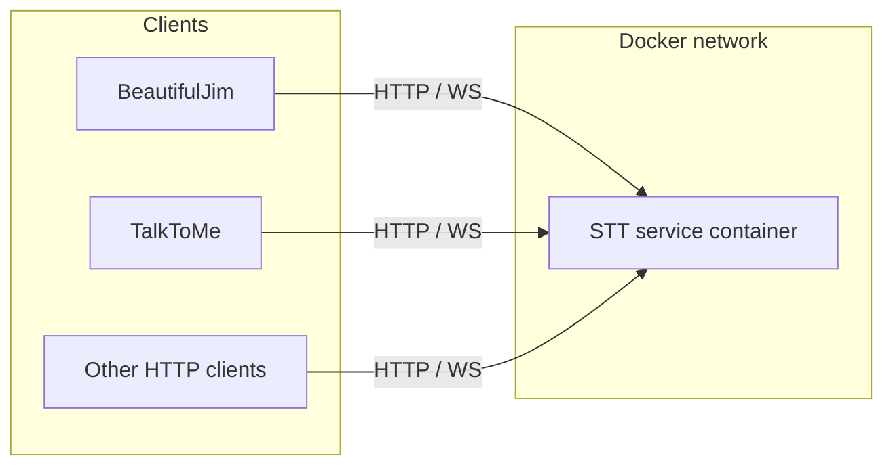

# Shared HTTP / WebSocket STT service

This document describes how to run **one Moonshine-backed speech-to-text (STT) service** that many applications (different repos, languages, or runtimes) can call over the network. The reference implementation lives under [`examples/python/stt-http-service/`](../examples/python/stt-http-service/).

## Goals

- **Single place** for models, caching, and upgrades: consumers do not embed `moonshine-voice`.
- **Any client** that can speak HTTP or WebSockets can use STT (Python, Node, mobile, etc.).
- **Docker-friendly**: one container (or scaled replicas) on a shared Docker network.

## Architecture



Inside the service process:

- The **Moonshine** Python API (`Transcriber`, `Stream`) performs real inference.
- A small **FastAPI** layer exposes:
  - **REST** for whole-file / batch transcription (simple integrations).
  - **WebSocket** for chunked audio and live partial transcripts (lower latency, streaming UX).

Models are resolved with `get_model_for_language()` from `moonshine-voice` (download on first use). Use a **persistent volume** for the model cache in production so containers do not re-download on every restart.

## API (reference implementation)

Base URL example: `http://stt:8080` on a Docker network.

### `GET /health`

Returns `{"status": "ok"}` when the process is up. Does not load a model.

### `POST /v1/transcribe`

Batch transcription of a **WAV** file (16- or 24-bit PCM; same rules as `moonshine_voice.utils.load_wav_file`).

| Part / field | Required | Description |
|--------------|----------|-------------|
| `audio` (multipart file) | yes | WAV bytes |
| `language` (form field) | no | Language code for model selection (default: `MOONSHINE_LANGUAGE` env or `en`) |
| `word_timestamps` (form field) | no | `true` / `false` — see [Word-level timestamps](word-level-timestamps.md) |

**Response JSON**

```json
{
  "language": "en",
  "sample_rate": 16000,
  "lines": [
    {
      "text": "hello world",
      "start_time": 0.0,
      "duration": 1.2,
      "line_id": 0,
      "is_complete": true,
      "speaker_index": 0,
      "words": null
    }
  ]
}
```

When word timestamps are enabled, each line may include a `words` array of `{ "word", "start", "end", "confidence" }`.

### `WebSocket /v1/transcribe/stream`

Real-time transcription: client sends a **config** message, then **binary** audio frames, then an **end** signal.

1. **Config** (text frame, JSON):

```json
{
  "type": "config",
  "language": "en",
  "sample_rate": 16000,
  "word_timestamps": false,
  "update_interval": 0.25
}
```

2. **Audio** (binary frames): mono **float32** little-endian PCM samples, chunked at any size; `sample_rate` must match `config`.

3. **End** (text frame):

```json
{ "type": "end" }
```

**Server messages** (JSON text frames) include:

- `ready` — model/stream initialized.
- `line_started`, `line_updated`, `line_text_changed`, `line_completed` — each carries a `line` object (same shape as batch lines, without large `audio_data`).
- `final` — stream flushed after `end`.
- `error` — recoverable protocol or inference error.

After `final`, the server **closes the WebSocket** (an `error` frame is always followed by `final` before close).

## Model cache and concurrency

The reference service keeps a **small LRU cache** of `Transcriber` instances keyed by `(language, word_timestamps)`. Each cached transcriber has a **lock** so concurrent HTTP requests do not call the native library at the same time on the same handle.

Implications:

- **Throughput**: single process serializes work per model key; for more throughput, run **multiple replicas** behind a load balancer (each replica downloads its own cache unless you share a volume).
- **Many languages**: either allow the cache to grow (increase limit via env) or run **one service instance per language**.

Tune with environment variables (see the example [`README`](../examples/python/stt-http-service/README.md)).

## Docker

Typical **docker-compose** pattern:

- Service name `stt` (or `moonshine-stt`), image built from `examples/python/stt-http-service/Dockerfile`.
- **Volume** for models: the example [`Dockerfile`](../examples/python/stt-http-service/Dockerfile) sets `MOONSHINE_VOICE_CACHE=/data/moonshine_voice` so you can mount a named volume there (see [`docker-compose.yml`](../examples/python/stt-http-service/docker-compose.yml)).
- Other services set `STT_URL=http://stt:8080` and call `/v1/transcribe` or the WebSocket URL.
- **`PORT`** env (default `8080`) selects the listen port inside the container.

Do **not** expose the STT port on the public internet without **TLS** and **authentication** (reverse proxy, API gateway, or mTLS).

## Security

- The service has **no auth** in the reference app; treat it as an internal microservice.
- Add **network policies** so only trusted clients reach it.
- Optionally terminate TLS at a reverse proxy and add **API keys** or **OAuth** at that layer.

## When to use HTTP vs WebSocket

| Use case | Prefer |
|----------|--------|
| Upload a file, get full transcript | `POST /v1/transcribe` |
| Mic or live stream, partial results | `WebSocket /v1/transcribe/stream` |

## Related documentation

- [Word-level timestamps](word-level-timestamps.md)
- Python API: [`python/README.md`](../python/README.md)
